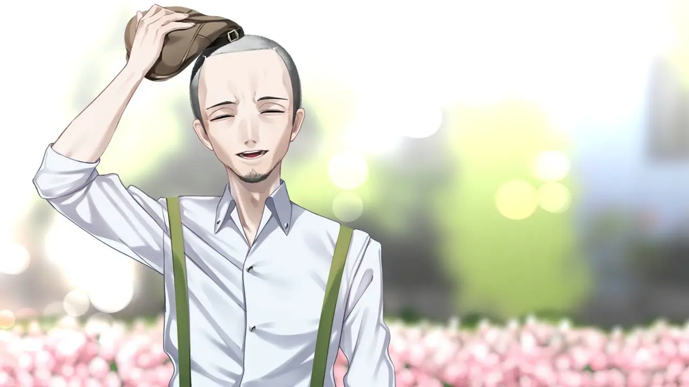

[//]: # (This is an item in your portfolio. It can be have images or nice text. If you name the file .md, it will be parsed as markdown. If you name the file .html, it will be parsed as HTML. )
### 就算是萝莉控都能看懂的世界观设定
由Qruppo制作并发行的《变态监狱》算是该社的第三部作品，其基础设定基本继承了原来《拔作岛》的世界观，算得上《拔作岛》的精神续作了。在本作中，霓虹本土并没有像青蓝岛一样那么开放，要是做出了什么变态行为是要吃上国家饭的，被关进臭名昭著的郁金香监狱。不幸的是，我们的男主柊一郎是一位喜欢以肉身贴近大自然的奇人，若是在四下无人之境解开束缚与自然亲密接触还好，偏偏柊一郎这样干的时候老是被抓个正着，惯犯柊一郎最后被忍无可忍的法官判了十年，投送进郁金香监狱。

落于孤岛之上的郁金香监狱原本是一个矿区，废弃之后被改造成了监狱，得天独厚的地理环境造就一个进出都难如登天的天然囚笼，就像美国的天堂岛监狱一样越狱率接近为零。既然哪里都是坐牢，为什么偏偏要送到郁金香监狱呢？一页一页，那就和普通的犯人没区别了嘛。能送进郁金香监狱的都是特别的，放在变态里都是超凡入圣的存在，柊一郎在这群大神里都是小卡拉米。关在此处的已经不是普通囚犯了，一定要出重拳！想干变态的事？那就偏不能让你如意，于是监狱有一个特殊指标——相奸系数。每隔一段时间狱警就要量化考核，看看谁忍不住干了坏事，就把他送进禁闭室。在这种规定下，依靠自卫发泄欲望已经不可能了，于是降低相奸系数苟住成为柊一郎新的任务。
### 我会让你遇难哦，Baby
似乎全世界所有和监狱相关的文学作品都逃不脱老狱友欺负新人的情节，同样柊一郎也不例外，特立独行的他因为不合群被几个老油条变着法来欺负，但是他仍然没有选择曲意逢迎，依旧独自一人对抗所有不公。在一次次被无情欺负之后，柊一郎抓住机会，和绰号叫做“无人机女孩”的新人一起反将那群恶人一军，让他们吃了个大瘪。“我会让你遇难哦，Baby！”这看似小孩才会说出的幼稚玩笑话，却让以凛和小泽为首的恶人团深刻记住了这个死脑筋的怪男孩。

在监狱中，部分表现好的囚犯可以通过接受“重生培训”来降低相奸系数，顺便摸摸鱼。在培训会上，作为培训内容的一环，需要组成小组来完成一项作品（不说了，大学时候的ptsd要犯了）。那么我们思路清奇的男主，首先想到的是做一个游戏，一个非常有变态风格的游戏。那么做游戏需要人手，不然搞出两个人做七年”自己吓自己“的笑话就不好玩了，于是在这一目标下，几位原来八竿子打不着的狱友组成了小团体，在变态监狱之中制作变态游戏的王道热血剧情由此开始。

### 一个成功男士的背后总有无数个女人
不管怎样项目还是立起来了，虽然柊一郎对怎么制作游戏一窍不通，但是他胜在人格魅力强，当个荣誉领导实则社团吉祥物平时加加油打打气也算是蛮有作用的。但是干活的人在哪？或许是他一条路走到黑的执拗还有不撞南墙不回头的坚定打动了她们，反正柊一郎依靠着独有的“万雌王”属性说服了原本毫无关系的三位女士，尽管他的古怪性格也被几位女士锐评为“像一只野猫”，但还是乐于为他效劳。
### 会画画的黑道大姐
做游戏当然需要美工人员，可是会画画的在这群干啥啥不行，变态第一名的废物中可不好找。某次柊一郎意外地看到监狱张贴的宣传画，其优秀的美术风格打动了柊一郎，于是他兜兜转转找到这位画家，但这尊大佛可不好请——她可是被羁押的极道头头波多江妙花，坐牢之前就统领着关东地区一整个极道的生意，妥妥普通人惹不起的存在。可是愣头青柊一郎不管这些，直接跑到她的地盘傻乎乎地去问"可以和我做一辈子游戏吗"，引得组内一众大佬的不满和愤怒。兴许是柊一郎这种过于认真的执拗勾起了她的兴趣，抑或是单纯好奇他的目的，妙花意外地答应了他的请求，成为游戏的专稿画师。

不管年龄还是地位上，妙花都是柊一郎的长辈。身为长辈当然要好好尽到照顾晚辈的义务，于是妙花开始教柊一郎如何为人处世，还有用来防身的拳法。渐渐地，妙花从最开始单纯对晚辈的欣赏变为更复杂的情感，可是理智告诉她自己不能把无辜者拉入极道的深渊之中。面对柊一郎“虽千万人，吾往矣”矢志不移的决心，此刻已不再是黑道老大，而单纯是少女的她，到底该如何抉择？

### 高科技人才“无人机女孩”
红林诺亚，绰号为“无人机女孩”，是和柊一郎同一批关进来的囚犯，此前因和柊一郎一同设计反抗恶人团而和他结识。和绝大多数被关在这里的人不同的是，红林诺亚有着无可匹敌的超高智商，熟练使用各种各样的高科技产品。按理来说依照她的智商不可能被关进监狱里，但是如果她是故意的呢？智商超群的她在某些事上却是超级小白，就比如和姐姐的关系。身为变态姐控的诺亚在连着发了无数信件之后还是久久不得姐姐的音讯，于是她故意犯罪进入监狱，想要找到当狱警的姐姐当面和她谈谈，希望能说服姐姐一起和她逃离这片苦海，可惜结果不尽如人意，但她还是没有放弃。

在了解诺亚的高超技术水平之后，柊一郎软磨硬泡好久，终于让她答应为游戏提供程序设计。随着和诺亚的接触越来越深，柊一郎发觉一直重点关注他的狱警索菲亚·西克连科竟然是诺亚的亲姐姐，但是两人之间的裂痕似乎很难修复。知晓这一秘密的柊一郎，到底该怎样做才能拯救诺亚冰冷的内心？

### 来自地狱的她
黑钟伊栖未，在监狱中很少露面，只能在图书馆的某个角落里才可能找到这位化名为“千咲都”的瘦小少女。据传说她是不可救药房的犯人，但是没有人知道她被关押在哪里，行踪神秘的她不喜欢和其他人接触，直到柊一郎邀请她加入游戏制作，她才肯在其他人前露面。平时沉默寡言的她只有在讨论文学相关的话题时才会多说两句，胆小如鼠的性格使她在小组之中没有什么存在感。

在多次遭受各路看守的厌恶和打骂之后，柊一郎发觉千咲都似乎并不受人欢迎，她就像厄运之源一样，除了自己的组员所有人都对她退避三舍。为了知晓她的过去，柊一郎开始和千咲都频繁接触，希望能打开她那颗封闭已久的内心。身材瘦小，可是内心无比坚强的千咲都到底有怎样的过去，一切都等待柊一郎去慢慢揭晓······

### 权力的游戏
游戏除了柊一郎一伙人制作游戏的主线，还有一条线——郁金香监狱内部吉列的蒸制豆蒸。水城所长年事已高，需要选出下一任所长，然而监狱之中又被分成水火不容的两派：一派是掌握武力，以夕颜为首的强硬派；一派是深得囚犯民心，以树里亚为首的教会派。想要在监狱之中搞出大动作的柊一郎不可避免地被卷入这场斗争之中，如何抉择站队才更符合自己的利益，才能让自己在监狱中有自己的不被打扰的一席之地？选择帮助夕颜干掉树里亚和她的教会铁腕控制监狱，还是辅佐树里亚扳倒夕颜让福音降临监狱，抑或是和姐姐后援会会长诺亚暗中做掉两派扶植不中用的软伦上位？一场九子夺嫡的精彩好戏即将开幕上演。

### 指明灯和引路人
柊一郎体内有两个灵魂：一个是自己，另一个是天津君。自从自己觉醒了变态癖好之后，天津君就成为指导他该如何面对生活的重要伙伴。天津君的存在是柊一郎谁也不会告诉的小秘密，就连他的姐姐柊菜子都不知情，直到他遇到自己人生中的那道光——樋口绘理子，一个脸上总是挂着微笑的心理医生。绘理子是柊一郎在监狱中的第一个朋友，是他最想倾诉的对象。和其他只会压榨囚犯的狱警不同，绘理子总是给人春风拂面的舒畅感，哪怕柊一郎说出多么不可思议的话，她也会像哄小孩子一样哄他。于是柊一郎开始向绘理子倾诉自己，然后在绘理子这里得到抚慰还有指导。可以说绘理子某种意义上成为柊一郎的人生导师，填补了他人生中缺失的长辈的位置，一步一步引导着柊一郎走上正道，在很多场合力挺柊一郎，甚至用职务之便暗中帮助柊一郎实现某些秘密交易。

渐渐地，在绘理子的支持之下，柊一郎开始慢慢成长起来，在监狱里的各个势力之间斡旋，去争得属于自己的权益。心智逐渐成熟的他和自己的天津君对话次数越来越少，直到再也听不见天津君的声音。从那一刻起，柊一郎终于知道，原来，自己长大了啊。

### 安迪与瑞德
和前作《拔作岛》只能走单线不同，《变态监狱》在三条单线之后还有一条后宫线，这可谓是一大进步。在这条线，柊一郎也不再只和某一人发展感情，而是积极寻求越狱的方法。而且柊一郎也不再是权力斗争的旁观者，而是成为权力斗争漩涡的中心——这意味着水城所长开始亲自培养柊一郎成为自己的接班人。然而权力终究不是这位心思单纯的大男孩所追求的对象，高墙之外的自由才是笼中之鸟的心之所向。柊一郎不能亲自获得他最想要的自由，于是他与水城做了个交易——释放他的三位制作组成员，以换取他的忠诚。水城没有违背诺言，按期释放了她们，柊一郎也对她们撒了谎，船上的相聚成为无缘再见的诀别。

越和水城共事，就越发现水城才是羁押变态的监狱中最龌龊肮脏的变态。柊一郎越来越抗拒和水城合作，暗中寻找逃出牢笼的方法。可是水城早已发现了一切，使用各种手段逼迫柊一郎顺从她的欲望。这一套或许在某些人身上起效，因为她的第一位学生钉谷也这样做了，可是现在的他已经成为苟活于此的所谓“采购员”。但是追梦之人不会被几颗石头绊倒，他所追求的，正是必然会实现的。铁与血铸成的锁禁锢不住追求梦想的笼中鸟，处处散发着自由的羽翼终会在光辉下闪耀。

正如《肖申克的救赎》之中安迪在暴雨中涅槃一样，柊一郎也在暴雨中重生，而身为采购员的钉谷成为最热衷于讨论柊一郎的瑞德，他羡慕着柊一郎的决心和勇气，也痛恨着自己的软弱和妥协。多年以后，钉谷前去柊一郎说过的学校天台，颤抖着找到那个写着他名字的信件，还有通往新世界的船票。一切都与矮墙之下的瑞德重合，他们都登上了那条船，怀着忐忑与不安踏上不会回头的旅途，见到了自己心中形象已经模糊的他，还有与旧时友跨越无数时空，最温暖最有力的拥抱。

### 别了，牢笼
单从剧情上来说，游戏给我的感觉更像是《肖申克的救赎》的翻版，柊一郎时时透漏出的对自由的渴望，成为一次又一次拯救他于堕落与沉沦的救赎。游戏的剧情水平相较于《拔作岛》更上一层楼，没有什么故作高深的哲学桥段，或者是匪夷所思的强行塞入，游戏剧情发展顺畅，起承转合都堪称优秀，个人来看是近几年少有的剧情佳作。画面上该说不说特别有本社特色，扁平化的线条式风格画风可能不太被大多数人接受（或者说上色单调，色差不明显导致画风显得扁平），看多了还是蛮舒服的，除了那几张难绷的特殊CG。个人十分推荐诸位静下心来花十几个小时完整体验整部作品，相信会带给大家潸然泪下的极致体验。